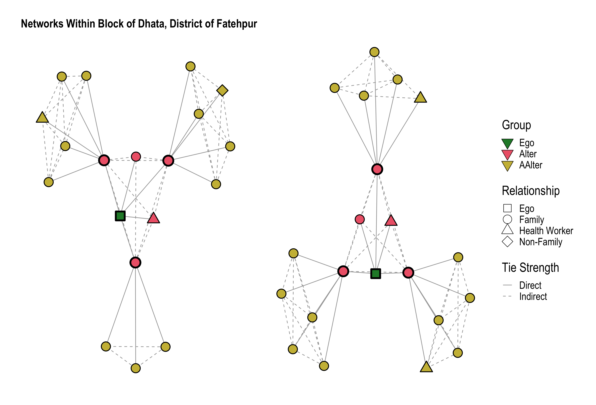

# Data Scientist, Geospatial Expert

## About Me
With a background in mathematics and a passion for leveraging data to address complex challenges, my skill set is tailored to working with a variety of structured and unstructured data to develop cutting-edge products and services. I have an MSc in remote sensing and specialize in geospatial applications, including over 5 years of experience leading scientific studies. I have worked closely with diverse clients and stakeholders across government, industry and academia, from project conceptualization to pre‑processing large datasets, developing machine learning algorithms and delivering insights backed by publications. This website hosts some of my recent endeavors, with a focus on building models that fuse together distinct datasets from varied sources.

## Projects

### Integration of Photo Interpreted and LiDAR Attributes into a Polygonal Forest Inventory Framework

### Projected Vegetation Dynamics Across Wyoming from 2000 to 2099 Using Satellite Imagery and Gridded Meteorological Data

### Historical Trend Analysis of Phenology Dates Across the Western US from 1982 to 2016

### Daily Estimates of Landsat Fractional Snow Covered Area Driven by MODIS and Dynamic Time Warping

### Applying Social Network Analysis to Understand Contraceptive Choices and Decisions of Young Women in Uttar Pradesh and Bihar, India
Over this two year project, I worked as a data science consultant for Braintree Global Health. As part of a Gates Foundation grant we supported a New Delhi-based team from the International Center for Research of Women to better understand the key people influencing maternal and newborn health decision-making in rural India. I spearheaded the design of a social network analysis (SNA) survey that included quantitative and qualitative questions of which we received 1,162 responses. Beyond calculating a series of descriptive statistics related to SNA, I developed a series of logisic regression models to better understand the likelihood of women using modern family planning methods. I also delivered SNA visualizations to better understand network structure.

*Figure 1: An example network plot showing the social networks of two young and low-parity women, including the types of relationships they have to others in their village/region and the strength of their ties. Each woman (“Ego") was asked to identify their five closest relationships (“Alter"). Select Alters were subsequently interviewed and asked to identify their five closest relationships as well (“AAlter”), thus constructing a web of direct and indirect ties to the Ego.*
